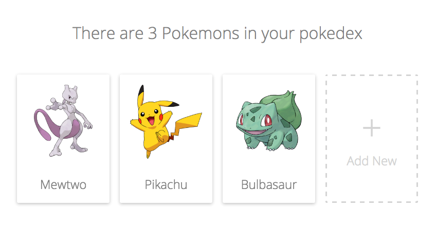

## Step 1: Warm up

It's time to get started! We will clone and setup our project in order to get our development environment up and running.

```sh
git clone https://github.com/learnrelay/pokedex.git
cd pokedex
git checkout step-01
npm install
npm start                                               # Open localhost:3000
```

Now, you should be able to visit http://localhost:3000 to see your beautiful Pokedex application, which should look like this:



Awesome! Let's move on!
